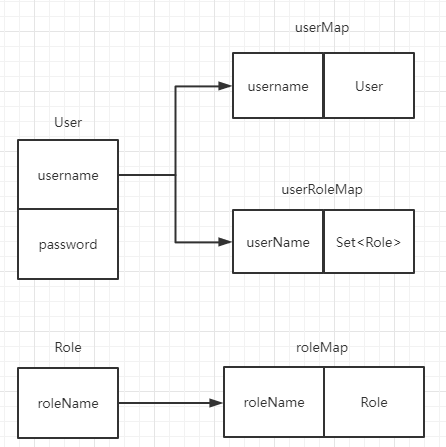

[toc]

### 概要设计文档

#### 1. 项目概述：

*本项目旨在设计一套包含用户、角色信息管理及鉴权功能的系统。*

###### 项目结构：

```
...
    src                         源代码包
     |-- main                       主包
        |-- commons                     全局常量、全局返回包装类
        |-- controller                  API接口层
            |-- BaseController              包装返回对象接口基类
            |-- RoleContrller               角色相关接口
            |-- UserController              用户相关接口
        |-- dao                         数据访问层
            |-- RoleDao                     角色相关数据处理
            |-- UserDao                     用户相关数据处理
        |-- model                       对象层
            |-- Role                        角色对象    
            |-- User                        用户对象
        |-- service                     业务逻辑层
            |--UserService                  用户管理模块
            |--RoleServcie                  角色管理模块
        |-- utils                       自定义工具包
            |-- EncryptUtil                 密码加密工具类
            |-- TokenUtil                   Token生成工具类
     |-- test                   单元测试代码        
```

#### 2. 实现方案：

##### a) 用户对象

**属性**：

*username 用户名（唯一、作为主键）;*

*password 密码（加密存储）*

**存储方式**：

内存存储

##### b) 角色对象

**属性**：

*roleName 角色名称（唯一、作为主键）;*

**存储方式**：

内存存储

##### c) 密码的加/解密方式：

采用getBytes()并与指定密钥异或操作加密；再次与密钥异或操作则完成解密

##### d) Token：

使用Java-JWT生成token，把用户名作为audience，密码作为pwd放入payload。设置过期时间：2h

使用HMAC256签名，secretKey = "A-SECRETE-TO-SIGN"

#### 3.E-R 图



#### 4.引用外部类库

* junit-jupiter-engine Junit5引擎
* junit-jupiter-api Junit5接口（主要用到断言）
* java-jwt 生成JsonToken
        
        
        
